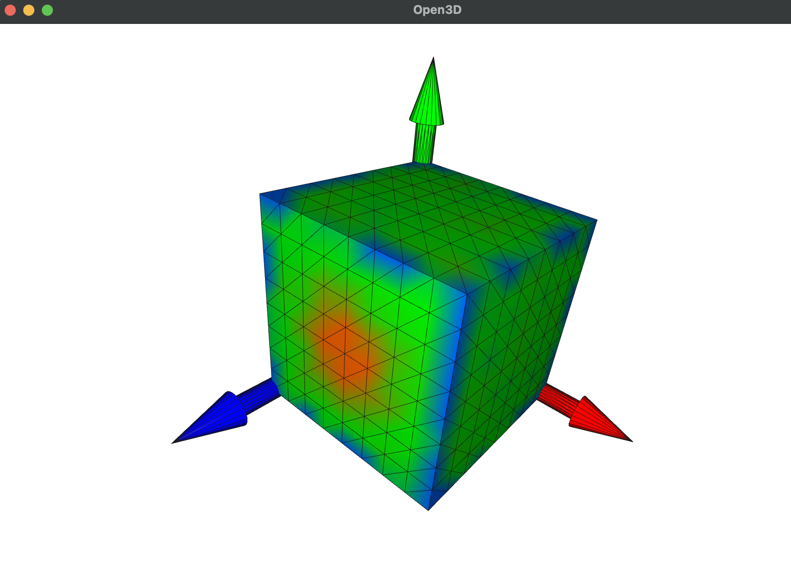
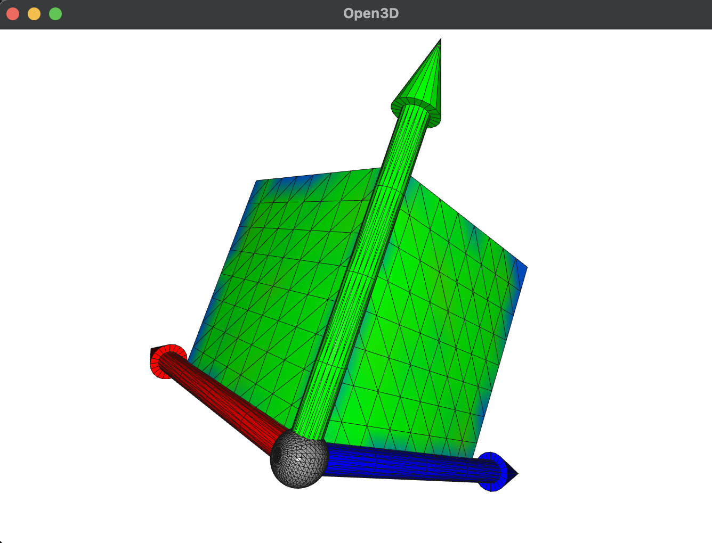

# CAD vs “Measured” Point Cloud Deviation (Open3D)

This script generates a **nominal CAD cube mesh** and a **synthetic measured point cloud**, then visualizes a “puddle plot” style deviation map by coloring the CAD surface based on **signed normal deviation** from nearby scan points.

It’s meant as a small demo for concepts like:
- deviation analysis / inspection coloring
- point cloud noise vs systematic deformation
- per-face error summaries
- robust statistics (median of neighbors)

## What it does

1. **Create a nominal CAD cube**
   - Builds a unit cube `[0,1]^3` using Open3D.
   - Densifies it using **midpoint subdivision** (preserves the shape).

2. **Create a synthetic “measured” point cloud**
   - Uniformly samples points from the nominal cube.
   - Adds **Gaussian noise** (jitter).
   - Adds a **Gaussian bump** near the top face (`z ≈ 1`) to simulate a bulge/dent.

3. **Compute deviations (CAD vs measured)**
   - For each CAD vertex, finds the **nearest axis-aligned face normal** (X0, X1, Y0, Y1, Z0, Z1).
   - Uses a KD-tree to grab **K nearest scan points**.
   - Projects neighbor vectors onto the face normal and takes the **median projection** as a robust signed deviation.

4. **Color the CAD mesh**
   - Green = within tolerance near 0
   - Red = positive deviation (scan outside)
   - Blue = negative deviation (scan inside)

5. **Prints a deviation report**
   - Overall stats: mean, median, std, RMS, max, p95
   - Counts within tolerance
   - Per-face breakdown (X0/X1/Y0/Y1/Z0/Z1)
   - ASCII histogram of signed deviations

6. **Visualizes**
   - Shows the colored CAD mesh + coordinate axes.
   - Wireframe/back-face enabled for inspection.

## Screenshots
| | |
|---|---|
|  |  |


## Example output (typical run)

```text
=== Deviation Summary (signed along nearest-face normal) ===
N vertices      : 386
Tolerance (±)   : 0.0020 units
Mean / Median   : -0.00108 / -0.00004
Std / RMS       : 0.00355 / 0.00371
Max |dev| / p95 : 0.02391 / 0.00834
Within tol      : 335 / 386  (86.8%)
Over + / Over - : 4 / 47

--- Per-face statistics ---
X0: N=   81  mean=-0.00250  med=-0.00011  rms=0.00598  p95=0.01477  within=64/81 (79.0%)
X1: N=   81  mean=-0.00151  med=-0.00018  rms=0.00394  p95=0.00846  within=68/81 (84.0%)
Y0: N=   63  mean=-0.00105  med=-0.00006  rms=0.00312  p95=0.00750  within=53/63 (84.1%)
Y1: N=   63  mean=-0.00081  med=-0.00002  rms=0.00282  p95=0.00531  within=56/63 (88.9%)
Z0: N=   49  mean=+0.00000  med=-0.00000  rms=0.00015  p95=0.00024  within=49/49 (100.0%)
Z1: N=   49  mean=+0.00052  med=+0.00025  rms=0.00089  p95=0.00211  within=45/49 (91.8%)

--- Histogram (excerpt) ---
-0.0239 – -0.0228 | (1)
-0.0228 – -0.0218 | (2)
...
-0.0013 – -0.0003 | ######## (48)
-0.0003 – +0.0008 | ################################################## (280)
+0.0008 – +0.0019 | (5)
+0.0019 – +0.0030 | (4)
```

How to read this:

Within tol shows how many CAD vertices fall inside the ±2mm band (here: 86.8%).

Z1 corresponds to the top face (z≈1). A small positive bias here is expected because the script injects a Gaussian bulge on that face.

The histogram shows most deviations clustered tightly around zero, with a small tail of larger negative/positive outliers.


## Requirements

- Python 3.9+ (3.10+ recommended)
- `numpy`
- `open3d`

Install:
```bash
pip install numpy open3d
